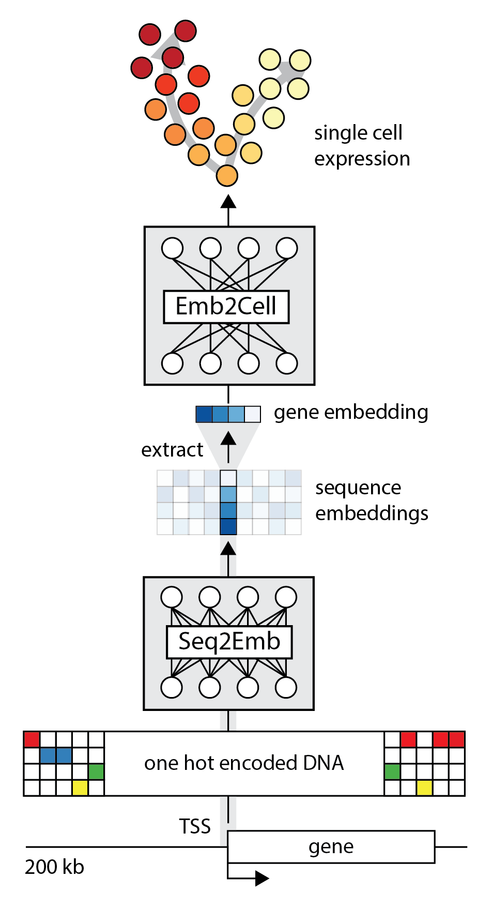

# seq2cells

*Copyright 2023 GlaxoSmithKline Research & Development Limited. All rights reserved.*

Code associated with the seq2cells
[manuscript](https://www.biorxiv.org/content/10.1101/2023.07.26.550634v1).

Seq2cells provides a framework for predicting single-cell gene expression
from DNA sequence. Seq2cells consists of two modules, seq2emb and emb2cell.
The input to seq2emb is a ~200kb DNA sequence centered on 
the transcription start site (TSS) of a gene. The output from emb2cell is the 
predicted expression in each cell of a given single cell dataset.



As the seq2emb module we use the trunk of
[Enformer](https://www.nature.com/articles/s41592-021-01252-x).
From the Enformer trunk output we extract the DNA sequence embedding of the TSS. 
As the emb2cell module we train a two-layer MLP.
The model can be run end-to-end or using cached DNA sequence embeddings.

Bulk expression data or pseudo-bulked single cell expression data can be
also be processed if provided as a single cell [AnnData](https://anndata.readthedocs.io/en/latest/) 
matrix where the cell axis is replaced by a cell type axis.


## Links & Resources

- [Pre-print](https://www.biorxiv.org/content/10.1101/2023.07.26.550634v1)
- [Zenodo](https://doi.org/10.5281/zenodo.8314644) - shared data and models including:
    - pre-trained models
    - ML ready pre-processed single cell data with TSS embeddings
- Publicly available single cell data used in the manuscript
    - [T cell developmental atlas](https://zenodo.org/record/3572422)
    - [CD4 T cell activation data](https://trynkalab.sanger.ac.uk)

----

## Install

- clone/download seq2cells repo
- navigate to seq2cells root
- uncomment `cudatoolkit` dependency in [`environment.yml`](./environment.yml) if using GPU

```
# create env
conda env create -n seq2cells -f environment.yml

# activate env
conda activate seq2cells

# add seq2cell directory to PYTHONPATH:
export PYTHONPATH="${PYTHONPATH}:/Path/to/location"
```

- to run preprocessing, the bedtools cli is required to run intersects

```
conda install -c bioconda bedtools
bedtools intersect --help
```

or see 
[bedtools install instructions](https://bedtools.readthedocs.io/en/latest/content/installation.html#installing-stable-releases).

**Note:** Pinned versions are those used in the manuscript. Other versions were not tested. Miniconda v4.12.0 was used.

---

## Test

Under [`tests`](./tests) we provide minimal `.sh`
scripts to run the seq2cell workflow(s) using a toy single cell dataset of 50
genes for 2600 cells.

```
# Navigate to tests directory
cd tests
```

**1) Pre-process TSS**
[`repro_preprocess.sh`](./tests/repro_preprocess.sh)
* (Optional) Modify [`repro_preprocess.sh`](./tests/repro_preprocess.sh)
  to include running Enformer embedding computation
  (computationally expensive), excluded by default.

```
sh repro_preprocess.sh <hg38.fa>
```

**2) Train model**
[`repro_train_sh`](./tests/repro_train.sh)

```
sh repro_train_sh
```

**3) Predict and evaluate**
[`repro_predict_eval.sh`](./tests/repro_predict_eval.sh)

```
sh repro_predict_eval.sh <checkpoint.ckpt>
```

**4) Variant effect prediction**
[`repro_vep.sh`](./tests/repro_vep.sh)

```
sh repro_vep.sh <checkpoint.ckpt> <hg38.fa>
```

**Notes:**

* To run variant effect prediction and the embedding calculation you need a
  local copy of the Enformer PyTorch weights shared on huggingface. A copy
  is downloaded to your `.cache` if you do not explicitly point to a cached
  version in the corresponding config files and no version is found in your
  default `.cache`.


* To run the preprocessing and variant effect prediction you need the reference 
  genome (hg38) as fasta file (.fa) and index (.fa.fai) in same directory.
  Download hg38 from e.g.
  [UCSC](https://hgdownload.soe.ucsc.edu/goldenPath/hg38/bigZips/).
  Index with e.g. [samtools](http://www.htslib.org/doc/samtools-faidx.html)
  samtools-faidx

`wget https://hgdownload.soe.ucsc.edu/goldenPath/hg38/bigZips/hg38.fa.gz`


---

## Full Workflow

### Requirements

**Single cell data**:

- Single cell data is expected as
  [AnnData](https://anndata.readthedocs.io/en/latest/)
  object with cells as
  observations (`.obs`) and genes as variables (`.var`). We recommend
  processing with [scanpy](https://scanpy.readthedocs.io/en/stable/index.html).
- We provide a toy dataset of 50 genes x 2600 cells subsampled from the 10x
  Genomics example
  [3k PBMC](https://support.10xgenomics.com/single-cell-gene-expression/datasets/1.1.0/pbmc3k)
  to test the training and evaluation functionality
  [`single_cell_data`](tests/resources/single_cell_data).
- The full 3k PBMC dataset prepared for seq2cell runs with sequence
  embeddings and predictions from a
  pre-trained model are available under `seq2cells_datashare/data/pbmc_data`.
- The single cell data used in our
  [pre-print](https://www.biorxiv.org/content/10.1101/2023.07.26.550634v1)
  with sequence embeddings and predictions from the published models are
  available under `seq2cells_datashare/data`.

If pre-computing sequence embeddings yourself you will also need:

**Gene annotation** or other regions of interest and a **reference genome** 
file in fasta format.


### Pre-processing

**0. Short-cuts**

Pre-processing may be skipped by using the provided data:

- Pre-processed sequence embeddings for all canonical TSS of protein
  coding genes (Gencode V41) are available under
  `seq2cells_datashare/precomputed_embeddings` matching the TSS sequence
  query windows under `seq2cells_datashare/preprocessing/tss_queries`.
- Single cell data with the corresponding TSS embeddings attached to each
  gene are available under `seq2cells_datashare/data`

**1. Formatting the sequence queries.**

Details for getting sequence queries
and preprocessed TSS embeddings are documented
[here](seq2cells/scripts/preprocessing/README.md).
In brief, given a set of regions of interest (ROI), e.g. TSS, a sequence
query file and precomputed sequence embeddings are produced.

**2. Acquiring the single cell data and processing them further if needed.**

If using publicly available single cell data, we recommend
downloading processed count matrices or re-analysing raw data as described
by the respective authors. We used library-size-normalized, log(x+1)
transformed and covariates-regressed-out observations for the manuscript.

**3. Combining single cell data and TSS embeddings.**

The process involves:

- Transposing the AnnData object to have the genes as
  `.obs` and cells as `.var`.
- Matching the pre-computed embeddings and single cell data genes based on
  their gene ID (e.g. Ensembl ID).
- If the single cell data were stored with gene symbols rather than gene IDs,
  the gene IDs (e.g. Ensembl ID) can be fetched from the prepared query file.
  Duplicates are dropped in this process. Note that single cell data indexed
  by gene symbols always carries the risk of mis-aligning the correct TSS
  with matching observed gene reads.
- Storing the sequence embeddings in the `.obsm['seq_embedding']` slot.
- Genes are split into training, validation, test genes based on overlaps
  with train, valid, test genes. Provide gene ids for test and validation
  set in raw text files. For the manuscript we defined train/test/valid gene
  based on
  intersection with the Basenji2/Enformer training regions.
  When using the Enformer trunk we highly recommend to maintain
  this split on which the Enformer trunk was trained. Use
  [`intersect_queries_with_enformer_regions.py`](seq2cells/scripts/preprocessing/intersect_queries_with_enformer_regions.py)
  described  
  [here](seq2cells/scripts/preprocessing/README.md)
  to get test and validation ids for your dataset.

Using [`add_embeddings_to_anndata.py`](seq2cells/scripts/preprocessing/add_embeddings_to_anndata.py)

```
python add_embeddings_to_anndata.py \
  --query query_gencode_v41_protein_coding_canonical_tss_hg38_nostitch.tsv \
  --anndata single_cell_data.h5ad \
  --emb precomputed_embeddings.h5 \
  --out_name single_cell_data_with_embeddings \
  --valid_ids valid_ids.txt \
  --test_ids test_ids.txt \
  --strip
```

### Training

Training a seq2cell module requires the processed single cell data with
stored sequence embeddings in AnnData format. Training from DNA sequences
without precomputed embeddings is possible but computationally expensive as
the full Enformer trunk is run and trained if not frozen.

Inspect the logs with tensorboard and compare training and validation
correlation across tss
(genes) and across cells to assure you pick the optimal checkpoint.
By default early stopping is employed on the validation set cross cell
correlation with a patience of 5 epochs, requiring a minimum improvement
of 0.001. The top 3 checkpoints are stored. We trained for a maximum of 30
epochs.

Using [`fine_tune_on_anndata.py`](seq2cells/scripts/training/fine_tune_on_anndata.py)

Adapt [`config_anndata_fine_tune.yml`](seq2cells/scripts/configs/config_anndata_fine_tune.yml)
.
Or use the provided configuration for training a model on the
[`toy pbmc dataset`](`seq2cells/tests/resources/single_cell_data/pbmc_toy_example.h5ad`)
only adjust the output directory, the path to the toy single cell data and
to your copy of the hg38 reference genome.

```
python eval_single_cell_model.py config_file=config_anndata_eval.yml
```

Pretrained model checkpoints are available to download under
`seq2cells_datashare/models`

### Evaluation

Trained models are evaluated by comparing the observed and
predicted expression and calculating the mean cross-gene and
cross-cell correlation as well as a the cross-cell correlation per gene
using [`eval_single_cell_model.py`](seq2cells/scripts/training/eval_single_cell_model.py)

Requires a model checkpoint and an AnnData object matching the trained model.

The model is loaded and run in inference mode and the predicted expression
values are usually saved in a copy of the AnnData object.

If inference has already been run, the AnnData object with stored predictions
can be used to skip the prediction step.

Adapt [`config_anndata_eval.yml`](seq2cells/scripts/configs/config_anndata_eval.yml)
or use the provided configuration for evaluating on the
[`toy pbmc dataset`](`tests/resources/single_cell_data/pbmc_toy_example.h5ad`).

```
python eval_single_cell_model.py config_file=config_anndata_eval.yml
```

Note: Inference is only supported on a single device.

### Variant Effect Prediction

Adapt [`config_predict_variant_effect.yml`](./seq2cells/scripts/configs/config_predict_variant_effect.yml)
or use the provided configuration for predicting 3 example variants with a
model trained against the
[`toy pbmc dataset`](`./tests/resources/single_cell_data/pbmc_toy_example.h5ad`)
.
Note, this requires to run an example training run first.
Alternatively, adjust the config to use one of the trained models provided
via `seq2cells_datashare`.

```
python predict_variant_effect.py config_file=config_predict_variant_effect.yml
```

* Expects variants in .tsv format where the 6th column should contain the
  gene or other ID that was used to uniquely identify the sequence queries as
  this is used to match
  e.g.

```angular2html
chr1_931513_T_C_b38    chr1    931513    T    C    ENSG00000187634.11
chr1_942951_C_T_b38    chr1    942951    C    T    ENSG00000187634.11
chr1_1050658_G_C_b38    chr1    1050658    G    C    ENSG00000188976.10
```

* Stores variants that could be matched to the sequence queries and filtered
  out variants separately.
* Stores a pytorch tensor and reference and variant predictons as numpy arrays.
* The expected format is num_variants x num_cells
* Only SNVs are currently supported
* To run variant effect prediction you need a local copy of the Enformer
  pytorch weights. If you ran a model training from sequence this will have
  been downloaded automatically to your `.cache`
  Other wise they can be downloaded from
  via https://huggingface.co/EleutherAI/enformer-official-rough
  to download open a python console and run the following to store a copy of
  the model in your .cache

```
from enformer_pytorch import Enformer

enformer = Enformer.from_pretrained('EleutherAI/enformer-official-rough')
```


## References

* All Enformer work was adapted from
the [public pytorch implementation](https://github.com/lucidrains/enformer-pytorch)
by lucidrains. 
* DeepMind's published PyTorch weights are available
via [huggingface](https://huggingface.co/EleutherAI/enformer-official-rough).
